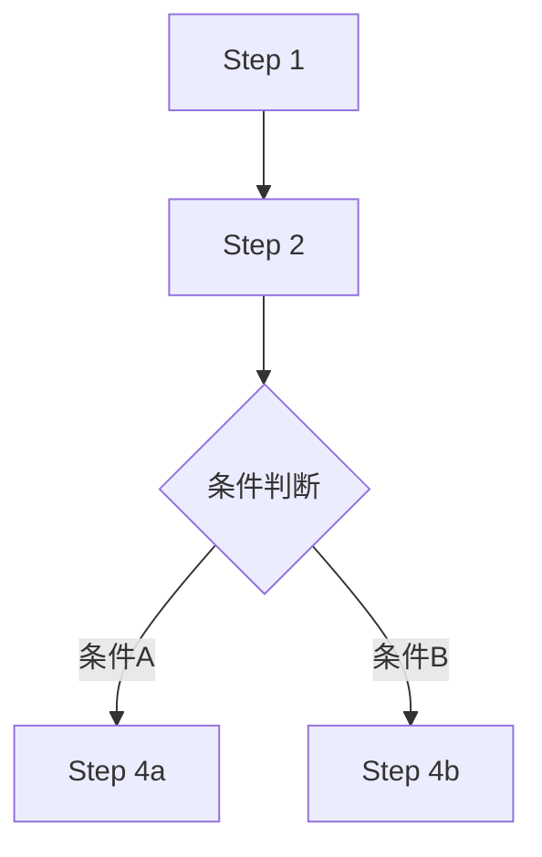

# 常见改进模式


评审完成后，根据扣分维度推荐对应的改进模式。


---


## D4 检查点不足 → "必须暂停"模式


**问题**：Skill 在关键决策点未强制暂停，Agent 可能做出不可逆错误决策。


**改进模板**：


```markdown

## 检查点 N：[检查目的]


**必须暂停。** 向用户确认以下内容：

1. [确认项1]

2. [确认项2]

3. [确认项3]


**未获得确认前不得继续下一步。**

```


**最佳实践**：

- 至少 2 个检查点：启动前 + 输出后

- 不可逆操作前必须有检查点

- 每个检查点列出具体确认项（不要只说"请确认"）


---


## D3 边界条件缺失 → "异常处理表"模式


**问题**：Agent 遇到异常时不知如何处理，可能停滞或给出错误输出。


**改进模板**：


```markdown

## 异常处理


| 异常情况 | 检测方式 | 处理方案 |

|---------|---------|---------|

| 用户输入信息不足 | [判断条件] | 追问具体问题，不猜测 |

| 依赖工具/API不可用 | [判断条件] | 降级到[替代方案] |

| 输出质量不达标 | [判断条件] | 触发修复循环，最多重试N次 |

| 用户中途改变方向 | 用户明确表示 | 暂停当前流程，确认新方向 |

| 超出技能能力范围 | [判断条件] | 诚实告知边界，建议[替代方案] |

```


**最佳实践**：

- 至少覆盖 3 种异常：输入不足 / 工具失败 / 输出不符

- 每种异常有具体的降级方案（不是"报错"）

- 有重试上限（避免无限循环）


---


## D6 资源堆积 → "References 分离"模式


**问题**：单文件过长（>300行），方法论/知识库/模板与执行流程混在一起。


**改进步骤**：


1. 识别可分离内容：

   - 方法论/理论框架 → `references/methodology.md`

   - 代码模板/示例 → `references/templates.md` 或 `scripts/`

   - 领域知识库 → `references/knowledge-base.md`

   - 评分标准/检查清单 → `references/checklist.md`


2. SKILL.md 保留：

   - Frontmatter

   - 工作流步骤（主干逻辑）

   - 检查点

   - 异常处理

   - 输出格式


3. 引用方式：

   ```markdown

   详细评分标准见 `references/rubric.md`。

   ```


**目标**：SKILL.md 控制在 150-300 行，读完知道"做什么"和"怎么做"，详细的"用什么做"放在 references。


---


## D2 工作流模糊 → "编号步骤+流程图"模式


**问题**：Agent 读完后不确定第一步做什么，需要自行推断执行顺序。


**改进模板**：


```markdown

## 工作流


### Step 1: [动作名]

[具体操作说明]


### Step 2: [动作名]

[具体操作说明]

**前置条件**：Step 1 完成


### Step 3: [决策点]

- 条件 A → 执行 Step 4a

- 条件 B → 执行 Step 4b


## 流程图




```


---


## D8 知识库型 → "可执行化"改造模式


**问题**：Skill 本质是方法论文档，Agent 读完仍需自行判断如何执行。


**改造步骤**：


1. **提取决策树**：从方法论中识别"在什么情况下用什么方法"

2. **转化为指令**：将"可以考虑X方法"改为"当[条件]时，执行[步骤]"

3. **添加输入/输出规范**：明确 Agent 需要什么输入、产出什么格式的输出

4. **嵌入验证环节**：每个输出后加质量自检


**改造前**（知识库型，D8≈16）：

```

## SWOT分析法

SWOT分析是一种常用的战略分析工具...优势、劣势、机会、威胁...

```


**改造后**（可执行型，D8≈22）：

```

## Step 3: SWOT分析


1. 列出内部优势（至少3条，每条1句话+1个数据支撑）

2. 列出内部劣势（至少3条，同上格式）

3. 列出外部机会（至少2条）

4. 列出外部威胁（至少2条）

5. 交叉匹配：SO策略（用优势抓机会）、WT策略（补劣势避威胁）


**输出格式**：

| 维度 | 条目 | 数据支撑 |

|------|------|---------|

| S-优势 | ... | ... |

```